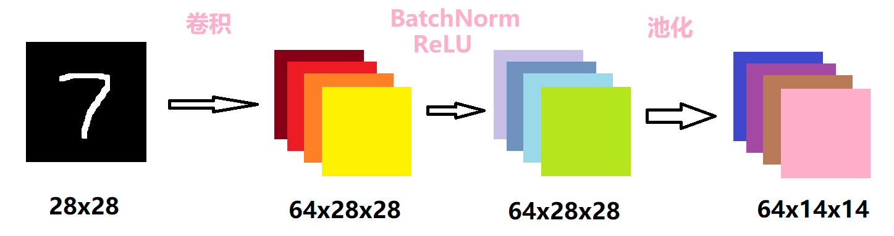

<center><b><font size = "7">智能算法与应用


<center><b><font size = "5">课程实验作业——图像分类任务

<center><b><font size = "5">MINIST数据集图像分类


<center><font size = "4">个人信息</center>

|  姓名  |   学号   |   班级   |
| :----: | :------: | :------: |
| 方展鸿 | 19308030 | 计科一班 |


---


### 1 实验环境

操作系统： Windows 11

Python：Python 3.8.6


### 2 实验任务

#### 2.1 图像分类任务

​		图像分类任务的目标是根据图像信息中所反映的不同特征，把不同类别的图像区分开来。从已知的类别标签集合中为给定的输入图片选定一个类别标签。

#### 2.2 MNIST数据集

​		MNIST 数据集来自美国国家标准与技术研究所，National Institute of Standards and Technology（NIST）。训练集由来自 250 个不同人手写的数字构成，其中 50% 是高中学生，50% 来自人口普查局的工作人员。测试集也是同样比例的手写数字数据。

​		MNIST 数据集可在 http://yann.lecun.com/exdb/mnist/ 获取，它包含了四个部分：

- Training set images: train-images-idx3-ubyte.gz (9.9 MB, 解压后 47 MB, 包含 60,000 个样本)
- Training set labels: train-labels-idx1-ubyte.gz (29 KB, 解压后 60 KB, 包含 60,000 个标签)
- Test set images: t10k-images-idx3-ubyte.gz (1.6 MB, 解压后 7.8 MB, 包含 10,000 个样本)
- Test set labels: t10k-labels-idx1-ubyte.gz (5KB, 解压后 10 KB, 包含 10,000 个标签)

images中每个图片的大小是28x28，每个数值代表了一个像素值，值域是0到255，表示一个手写字；labels中每个标签是一个int类型的数值，表示手写字的数值。

#### 2.3 实验目的

- 掌握pytorch等深度学习框架的环境搭建
- 掌握图像分类任务的训练和测试流程


### 3 实验设计

#### 3.1 构建数据集及数据预处理

##### 3.1.1 数据预处理

​		导入数据集的方式有很多。最简单的一种就是直接调用PyTorch封装好的函数。因为PyTorch里包含了 MNIST， CIFAR10 等常用数据集，调用 torchvision.datasets 即可把这些数据由远程下载到本地，下面给出MNIST的使用方法：

```python
torchvision.datasets.MNIST(root, train=True, transform=None, target_transform=None, download=False)
```

- root 为数据集下载到本地后的根目录，包括 training.pt 和 test.pt 文件
- train，如果设置为True，从training.pt创建数据集，否则从test.pt创建。
- download，如果设置为True, 从互联网下载数据并放到root文件夹下
- transform, 一种函数或变换，输入PIL图片，返回变换之后的数据。
- target_transform 一种函数或变换，输入目标，进行变换。

​		因此，简单地使用datasets.MNIST即可导入训练集和测试集。

```python
# 训练集导入
data_train = datasets.MNIST(root='data/', transform=transform, train=True, download=True)
# 数据集导入
data_test = datasets.MNIST(root='data/', transform=transform, train=False)
```

​		当然我觉得这么做很没有意思，我想自己看看这数据集是什么内容。于是我直接下载了该数据集，得到如下文件：


​		既然要手工处理，那首先得把二进制文件转换成既方便存储，又方便读取，我们还能够看得懂的文件，那么csv格式当仁不让。因此，实现了一个函数，用于读取二进制文件，并写入csv文件。

```python
# utils.py
def convert(img_file, label_file, out_file, n):
    '''
    用于将数据集和标签转换成csv格式
    img_file 数据集的路径
    label_file 标签的路径
    out_file 需要存储的csv的路径
    '''
    if os.path.isfile(out_file):
        return

    f = open(img_file, "rb")
    l = open(label_file, "rb")
    o = open(out_file, "w")

    f.read(16)
    l.read(8)
    images = []

    print("Generator " + out_file + " ...")
    for i in tqdm(range(n)):
        image = [ord(l.read(1))]
        for j in range(28 * 28):
            image.append(ord(f.read(1)))
        images.append(image)

    for image in images:
        o.write(",".join(str(pix) for pix in image) + "\n")

    f.close()
    o.close()
    l.close()
```

csv中的每一行都代表一个数据，其中第一维是标签，后面的28x28维是数据，也就是图片的像素值。csv的格式如下：


​		然后将数据集和测试集都进行转换：

```python
# predata.convert_data()
convert(train_images_path, train_labels_path, data_path, 60000)
convert(test_images_path, test_labels_path, test_path, 10000)
```

得到如下结果：


​		接下来，我们可以采样一个数据，看看图片的内容。

```python
# utils.py
def sample_data(source):
    '''
    用于采样一个数据集
    source 数据集路径(csv)
    '''
    csv_file = csv.reader(open(source))

    for content in csv_file:
        content = list(map(float, content))
        feature = content[1:785]
        return feature
```

然后展示该图片：

```python
# predata.convert_data()
feature = sample_data(data_path)

b = np.array(feature).reshape(28,28)
img = Image.fromarray(np.uint8(b))
img.show() 
```

可以看到，由于是28x28的图片，图片非常小：


##### 3.1.2 构建数据集

​		Pytorch提供了许多方法使得数据读取和预处理变得很容易。

​		torch.utils.data.Dataset是代表自定义数据集方法的抽象类，通过继承这个抽象类来定义数据集。一般来说，只需要定义\_\_len\_\_和\_\_getitem\_\_这两个方法就可以。

​		而通过继承torch.utils.data.Dataset的这个抽象类，定义好数据类后，我们需要通过迭代的方式来取得每一个数据，但是这样很难实现取batch，shuffle或者多线程读取数据，所以pytorch还提供了一个简单的方法来做这件事情，通过torch.utils.data.DataLoader类来定义一个新的迭代器，用来将自定义的数据读取接口的输出或者PyTorch已有的数据读取接口的输入按照batch size封装成Tensor，后续只需要再包装成Variable即可作为模型的输入。

​		因此， 我们首先需要定义两个Dateset，分别表示训练集和测试集：

```python
# predata.py
class data_train(Dataset):
    '''
    train dataset
    '''
    def __init__(self):
        self.x = load_data(data_path)

    def __getitem__(self, idx):
        assert idx < len(self.x)
        return self.x[idx]

    def __len__(self):
        return len(self.x)

class data_test(Dataset):
    '''
    test dataset
    '''
    def __init__(self):
        self.x = load_data(test_path)

    def __getitem__(self, idx):
        assert idx < len(self.x)
        return self.x[idx]

    def __len__(self):
        return len(self.x)
```

其中，加载数据的部分如下：

```python
# utils.py
def load_data(source):
    csv_file = csv.reader(open(source))
    data = []
    for content in csv_file:
        content = list(map(float, content))
        feature = torch.tensor(content[1:785]).reshape(1,28,28)
        feature = feature / 255 * 2 - 1
        label = int(content[0])
        data.append((feature, label))
    return data
```

​		其中有很关键的一步，就是对数据进行归一化处理。由于输入像素的值域是0到255，而实际上我们希望数据服从均值为0，方差维1的分布。因此，手动实现了一个很简陋的归一化操作。当然，torchvision.transforms中有一个非常方便的方法可以处理：

```python
transform = transforms.Compose([
    transforms.ToTensor(),  # 把数据转换为张量（Tensor）
    transforms.Normalize(   # 标准化，即使数据服从期望值为 0，标准差为 1 的正态分布
        mean=[0.5, ],       # 期望
        std=[0.5, ]         # 标准差
    )
])
```

​		至此，数据集加载的整个流程已经完成。

```python
# minist.py
convert_data()            # 将数据集转换成csv
data_train = data_train() # 训练集导入
data_test = data_test()   # 数据集导入
dataloader_train = DataLoader(dataset=data_train, batch_size=64, shuffle=True) # 训练集装载
dataloader_test = DataLoader(dataset=data_test, batch_size=64, shuffle=True)   # 数据集装载
```

​		数据集加载完成后，我们可以浏览一下加载的数据，进行简单的核查：

```python
# minist.py
images, labels = next(iter(dataloader_train))
img = make_grid(images)
img = img.numpy().transpose(1, 2, 0)
mean = [0.5, 0.5, 0.5]
std = [0.5, 0.5, 0.5]
img = img * std + mean
print([labels[i] for i in range(16)])
plt.imshow(img)
plt.show()
```

还原得到如下图像：


#### 3.2 网络设计和参数优化

##### 3.2.1 网络设计

​		对于图像处理，一般使用卷积神经网络。MNIST是一个很简单的数据集，图片大小为28x28，因此使用普通的卷积神经网络就能取得不错的效果。

​		网络的基本结构为两层的卷积层和一层的全连接层。

​		第一层的卷积层如下所示：



​		首先对原图像做一个卷积核大小为3的卷积操作。由于输入的图片是黑白图片，只有一个通道，因此卷积的输入通道为1，输出通道为64。设置了padding为1，而卷积核的大小是3，因此输出的维度会和输入的维度相同。

​		接着对卷积的结果做归一化操作后，经过一个ReLU激活函数，这两步不会改变数据的维度。选择ReLU的原因很简单，由于数据集很简单，而该激活函数本身的计算很简单，节约了计算成本。

​		最后再做一个kernel大小为2的池化操作，设置步长为2，因此数据大小会缩小一半。池化层的作用主要是下采样，可以降维、去除冗余信息、对特征进行压缩、简化网络复杂度、减小计算量、减小内存消耗等等。简单来说，就是减少计算量。

```python
# net.py
# 第一层卷积层
self.conv1 = Sequential(
    nn.Conv2d(in_channels=1, out_channels=64, kernel_size=3, stride=1, padding=1),
    nn.BatchNorm2d(64),
    nn.ReLU(),
    nn.MaxPool2d(kernel_size=2, stride=2)
)
```

​		接着再堆叠一层卷积层。

```python
# net.py
# 第二卷积层
self.conv2 = Sequential(
    nn.Conv2d(in_channels=64, out_channels=128, kernel_size=3, stride=1, padding=1),
    nn.BatchNorm2d(128),
    nn.ReLU(),
    nn.MaxPool2d(kernel_size=2, stride=2)
)
```

​		步骤是类似的，输入的维度是64x14x14，输出维度为128x7x7。

​		堆叠多层卷积层的原因是，则随着层次加深，提取的信息也愈加复杂、抽象。可以理解为，神经元一层一层的堆积后，对图片内容的理解会更加抽象和深刻。

​		最后需要经过一个全连接层，将这128x7x7维度的信息转换成我们需要的输出标签。具体的结构如下：


先由一个线性传播层，将128x7x7的信息转化为维度为1024的隐藏层，再经过ReLU激活函数，以及Dropout操作。Dropout操作是会随机选择一些单元丢弃，我们设置的概率为0.5，也就是会丢弃一般的信息，目的是为了防止过拟合。

```python
# net.py
# 全连接层
self.dense = Sequential(
    nn.Linear(7 * 7 * 128, 1024),
    nn.ReLU(),
    nn.Dropout(p=0.5),
    nn.Linear(1024, 10)
)
```

​		最后，将这三层网络堆叠起来，并重写一个前向传播函数，即可实现该网络结构。

```python
# net.py
# 正向传播
def forward(self, x):
    x1 = self.conv1(x)
    x2 = self.conv2(x1)
    x = x2.view(-1, 7 * 7 * 128)
    x = self.dense(x)
    return x
```

##### 3.2.2 参数优化

​		实例化网络后，首先进行GPU优化。使用GPU能显著提高训练速度。

```python
# minist.py
cnn = CNN()
if torch.cuda.is_available(): # 判断是否有可用的 GPU 以加速训练
    cnn = cnn.cuda()
```

​		接着设置损失函数。损失函数我们使用分类任务中最常用的交叉熵损失函数。

```python
# minist.py
loss_F = nn.CrossEntropyLoss() # 设置损失函数为 CrossEntropyLoss（交叉熵损失函数）
```

​		优化器我们使用最常用的Adam优化器。

```python
# minist.py
optimizer = torch.optim.Adam(cnn.parameters(), lr=lr) # 设置优化器为 Adam 优化器
```

Adam优化器可以直白理解成RMSProp+Momentum，也就是动量梯度下降加上指数移动平均。动量梯度下降是仿照现实世界中物体的惯性，在运动时不仅要看当前这一步往哪里迈，还要考虑之前的运动状态，如果之前的步伐很快，就不应该在一步内急停或者急转弯。这样做的好处是可以跳出一些局部最小值。而RMSProp增加了一个超参数$\alpha$，这种计算梯度均值的方式其实就是指数移动平均，它更能稳定地反映梯度变化情况，且可以通过$\alpha$来调节对之前梯度和当前梯度的重视程度。通过Adam优化器，实现了**简单的自适应学习**。

#### 3.3 训练和测试

​		整体训练和测试的框架为：

```python
for epoch in range(epochs):
    # 训练
    # 测试
    # 打印信息
```

这种架构能够直观地反应出，每次训练后的效果变化。

##### 3.3.1 训练

​		首先我们设置训练的epoch的数量为10，学习率为0.01。

```python
# env.py
epochs = 10
batch_size = 64
lr = 0.001
```

​		接下来结合代码进行解析：

```python
# minist.py
# 训练
running_loss = 0.0     # 一个 epoch 的损失
running_correct = 0.0  # 一个 epoch 中所有训练数据的准确率
print("Epoch [{}/{}]".format(epoch, epochs)) # 打印当前的进度 当前epoch/总epoch数
for data in tqdm(dataloader_train): # 遍历每个数据，并使用tqdm反应训练进度
    X_train, y_train = data # data是一个tuple，第一维是训练数据，第二维标签
    X_train, y_train = get_Variable(X_train), get_Variable(y_train) # 将数据变成pytorch需要的变量
    outputs = cnn(X_train) # 将数据输入进入网络，得到输出结果
    _, pred = torch.max(outputs.data, 1) # 输出的结果是一个大小为10的数组
    									 # 我们获取最大值和最大值的索引，后者表示预测结果
    optimizer.zero_grad() # 梯度置零
    loss = loss_F(outputs, y_train) # 计算输出结果和标签损失
    loss.backward() # 根据梯度反向传播
    optimizer.step() # 根据梯度更新所有的参数
    running_loss += loss.item()  # 累计全局的损失
    running_correct += torch.sum(pred == y_train.data) # 计算准确率
```

##### 3.3.2 测试

​		测试的操作和训练大同小异，直接获取测试集的数据，输入网络中得到结果，并与实际的标签进行比较。由于和训练部分类似，不做具体赘述。

```python
# minist.py
# 测试
testing_correct = 0.0
for data in dataloader_test:
    X_test, y_test = data
    X_test, y_test = get_Variable(X_test), get_Variable(y_test)
    outputs = cnn(X_test)
    _, pred = torch.max(outputs, 1)
    testing_correct += torch.sum(pred == y_test.data)
```

​		最后打印训练信息：损失值（反应训练的效果）、训练集准确度、测试集准确度。

```python
# 打印信息
print("Loss: {:.4f}  Train Accuracy: {:.4f}%  Test Accuracy: {:.4f}%".format(
    running_loss / len(data_train),
    100 * running_correct / len(data_train),
    100 * testing_correct / len(data_test))
)
```

之所以需要打印训练集准确度，通过对比测试集准确度，可以观察是否出现过拟合或者是网络设计不当的情况发生。


### 4 实验结果

​		训练10个epoch后，得到结果如下：


​		10个epoch后，网络已经基本收敛，测试集的准确度达到了99.06%。


### 5 实验感想

​		智能算法与应用的实验，总是能够放松一周疲惫的身心，整个任务设计的流程使得成就感陡然上升。
​		经历了理论课程的洗礼，实验显然没有刚开始接触这门课程的时候那么生疏。从最开始只会照猫画虎，到有逐渐熟悉起来，能够自己实现整个框架，这个实验流程刻骨铭心。整个过程中，出现了很多实际效果并不如意的情况，有时候也不知道该怎么修改，有一些烦躁。但当陷入迷茫和困惑的时候，老师在课堂上的谆谆教诲总在脑海中浮现，给我前进的动力。
​		本次实验中，基本上没有遇到什么特别大的困难，比较顺利。
​		从这次实验中，真真切切地将这个学期实验中学习到的一些知识进行融会贯通，这是难能可贵的。我需要带着这种探索的精神，不断在学业的道路上，越走越远。

### 6 附件

文件附件如下：

```
D:.
│  实验报告.pdf
│  env.py
│  minist.py
│  net.py
│  predata.py
│  utils.py
│
└─data
       mnist_test.csv
       mnist_train.csv
       t10k-images.idx3-ubyte
       t10k-labels.idx1-ubyte
       train-images.idx3-ubyte
       train-labels.idx1-ubyte
```

各个python文件的作用如下：

- env.py：一些常量的设置
- net.py：cnn网络结构
- predata.py：数据预处理
- utils.py：一些小工具函数
- minist.py：主函数，训练测试入口

data文件中存储的是MNIST数据集。
